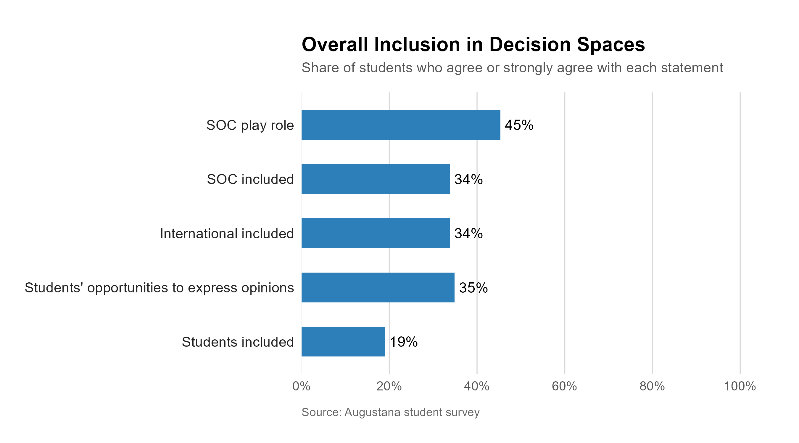
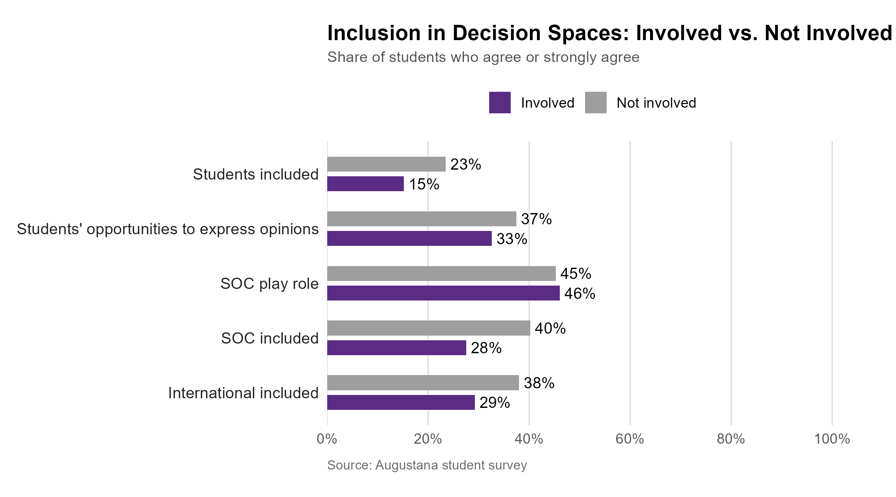
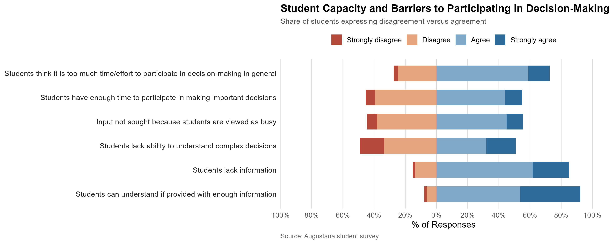
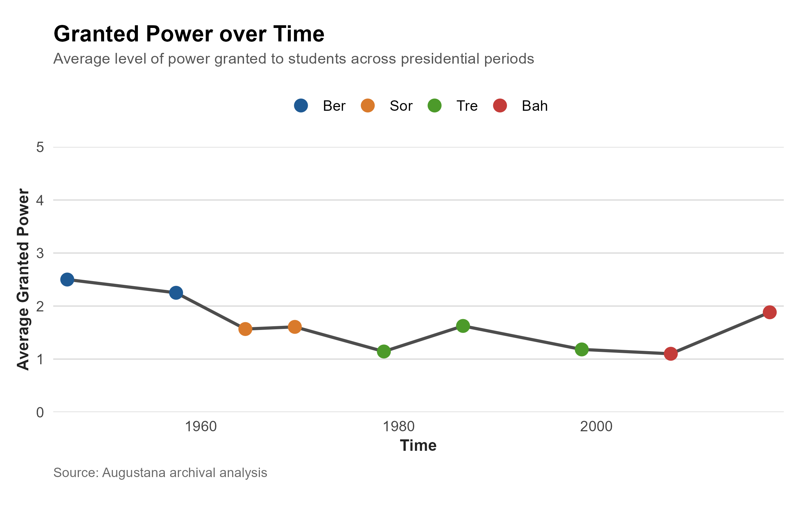
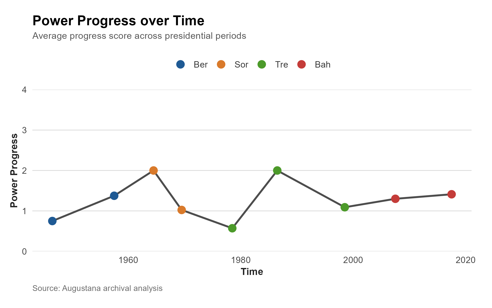
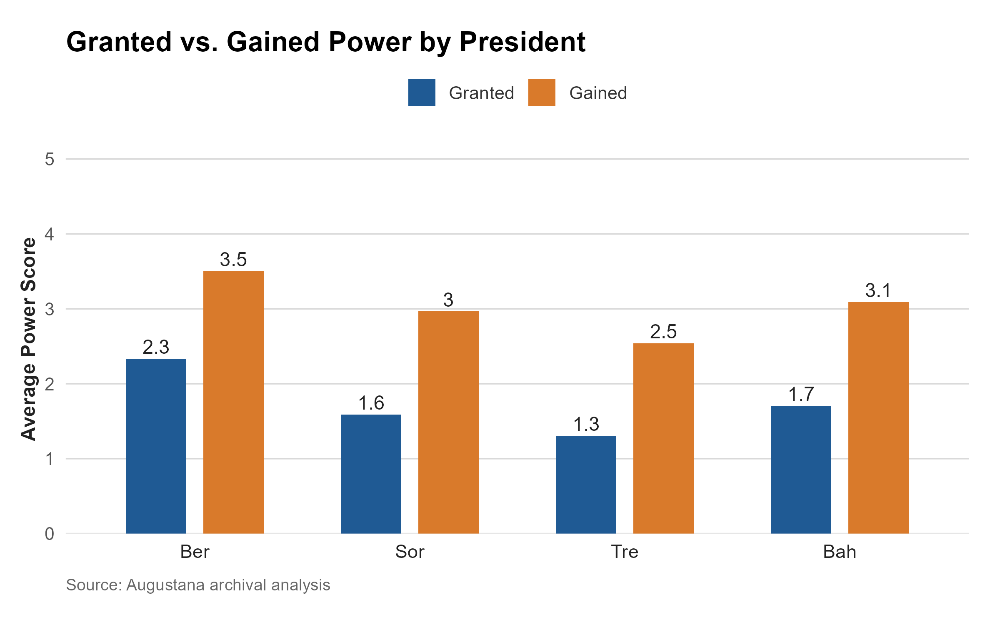
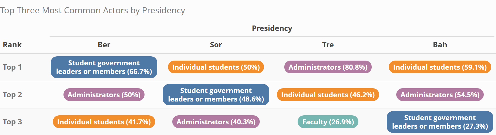

# Student Governance Data Analysis

This project investigates the evolving role of students in decision-making at Augustana College through a two-part analysis: a historical archival analysis and a contemporary student survey analysis.

The project examines whether democratic practices at Augustana have changed over time and how students currently perceive their role in institutional decision-making.

## Research Questions

1. What are students’ perceptions of their actual and ideal role in decision-making at Augustana College?
2. Are institutional practices becoming more or less democratic over time?
3. Has student voice gained or lost meaningful influence in college decision-making?

## Theoretical Framework

This project is based on Graham Smith’s framework from *Democratic Innovations: Designing Institutions for Citizen Participation*. The analysis focuses on four democratic dimensions:

- **Inclusiveness**: Who gets to participate and how representative participation is.
- **Popular Control**: The level of influence students have over decisions.
- **Considered Judgment**: Whether students have enough information, time, and capacity to participate meaningfully.
- **Transparency**: How clearly and openly decision-making processes and outcomes are communicated.

## Project Structure

The project contains two main analytical components:

### 1. Historical Analysis

The historical component uses archival data from *The Augustana Observer*, the college’s student newspaper. Articles and events were coded across four presidential periods:

- President Bergendoff
- President Sorenson
- President Treadway
- President Bahls

The historical coding framework measured student power through variables such as:

- **Granted Power**: formal power or authority given to students by the institution.
- **Gained Power**: influence or power students gained through action, organizing, or institutional response.
- **Power Progress**: the difference between gained power and granted power.

The historical analysis examines:

- Granted vs. gained power by president
- Power progress over time
- Average granted power by topic area
- Average power progress by topic area
- Most common actors by presidency
- Topic areas where student power was more or less visible

### 2. Contemporary Survey Analysis

The contemporary component uses a student survey distributed to Augustana students. The final dataset includes 364 student responses, representing roughly 15% of the student population.

The survey analysis focuses on:

- Overall perceptions of student inclusion
- Differences between domestic and international students
- Differences between White students and Students of Color
- Differences between involved and not-involved students
- Student perceptions of considered judgment
- Student perceptions of transparency

Key survey measures include:

- whether students are included in decision-making spaces
- whether students can express opinions on important decisions
- whether students have enough information to participate
- whether important decisions are clearly and timely communicated
- whether decision-making reasoning is explained to students

## Data Cleaning Pipeline

All data cleaning and analysis were conducted in **RStudio** using tidyverse-based workflows.

The survey cleaning pipeline included:

1. Importing the raw survey dataset from Excel.
2. Checking dimensions, column names, and data structure.
3. Grouping survey questions into conceptual categories:
   - demographics
   - inclusiveness
   - popular control
   - considered judgment
   - transparency
4. Reordering columns by analytical category.
5. Cleaning extra spaces in character responses using `str_squish()`.
6. Converting blank responses into `NA`.
7. Checking unique values across Likert-scale questions.
8. Creating a binary involvement variable:
   - `1 = involved`
   - `0 = not involved`
9. Renaming unclear demographic variables:
   - `student_status`
   - `race_ethnicity`
   - `class_year`
10. Checking duplicate rows.
11. Creating an `answered_count` variable to assess response completeness.
12. Exporting the final cleaned data as:
   - `cleaned_survey_data.csv`
   - `cleaned_survey_data.rds`

## Analysis Pipeline

### Survey Analysis

The survey analysis used cleaned survey data to create publication-style visualizations in R.

Main steps:

1. Load cleaned survey data.
2. Create grouping variables:
   - `race_group`: White vs. Students of Color
   - `involvement_group`: Involved vs. Not involved
3. Reshape survey responses into long format using `pivot_longer()`.
4. Convert Likert responses into agreement indicators.
5. Calculate percent agree / strongly agree.
6. Create visualizations for:
   - overall inclusion
   - inclusion by student status
   - inclusion by race group
   - inclusion by involvement status
   - considered judgment
   - transparency



### Historical Observer Analysis

The Observer analysis used coded archival data to examine student power over time.

Main steps:

1. Import Observer coding data from Excel.
2. Calculate period midpoint for each presidential period.
3. Normalize time within each presidency.
4. Aggregate progress and granted power by president and time period.
5. Compare:
   - granted vs. gained power
   - average granted power over time
   - average progress over time
   - average granted power by topic
   - average progress by topic
6. Convert topic and actor columns into long format.
7. Calculate topic-level and actor-level summaries.
8. Create publication-style charts and tables.




## Key Findings

### Contemporary Survey Findings

- Most students do not believe they are meaningfully included in decision-making processes.
- Only a small share of students agreed that students are regularly included in spaces where important decisions are discussed.
- Students generally believe that the major barrier to participation is not student ability, but lack of information and institutional transparency.
- Students who are more involved on campus tend to be more critical of student inclusion, likely because they have more direct experience with institutional decision-making spaces.
- Students report low transparency, especially around whether the reasoning behind decisions is clearly explained.

### Historical Findings

- Across the historical data, gained power was generally higher than granted power.
- Student power progress fluctuated across presidential periods.
- The historical record suggests that students sometimes gained influence, but formal and consistent inclusion remained limited.
- Topic-level analysis shows that student power varied depending on the type of institutional issue being discussed.

## Tools Used

- R
- RStudio
- tidyverse
- readxl
- dplyr
- tidyr
- ggplot2
- scales
- stringr
- kableExtra
- webshot2

## Repository Contents

Suggested repository structure:

```text
student-governance-analysis/
│
├── data/
│   ├── raw/
│   └── cleaned/
│
├── scripts/
│   ├── Survey Cleaning Code.Rmd
│   ├── Survey Analysis Visualization.Rmd
│   └── Observer Analysis Visualization.Rmd
│
├── figures/
│   ├── survey_figures/
│   └── observer_figures/
│
├── poster/
│   └── Final Poster Research.pdf
│
└── README.md
